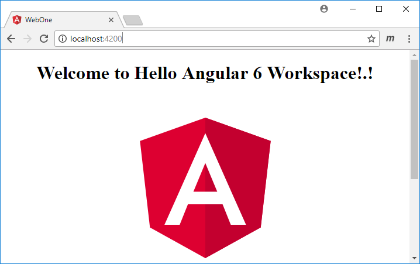

 # Angular 6 Workspace :: Test-Drive
 ## All The Cool Cats are Using Workspaces Now.


**Github.com**: [https://github.com/buildmotion/workspace-demo](https://github.com/buildmotion/workspace-demo)

The most recent version of Angular is a significant release - version 6.0.3 as of this post. We get a lot of new tools and features that help us have a more efficient develoment environment. 

Now when we use the new CLI, the new default environment is now a workspace (well, maybe not - more later) that allows for the development of multiple applications and libraries in a single workspace. When you add new applications and/or libraries, you are creating ` project ` items. A project item has a specific type to indicate whether it is an ` application ` or a ` library `. 

        application: is a single-page web application.
        library: is a module that is shared by multiple applications

The workspace tooling for Angular development was introduced awhile back by NRWL.io's Nx toolset. A package with a set of schematics that allow you to create a ` workspace ` using custom configuration provided by NRWL. If you use Nx, you create ` apps ` that is either a ` lib ` or an ` app ` (Angular Single Page Web application). It seems like I just started using NRWL's Nx Workspace. I'm wondering what the future will be for Nx - because the features are similar. 

Being able to reuse libraries across multiple applications is a great feature. It was definitely possible before. However, the workflow was much more intensive and required lots of configuration of the libraries. It is now much easier with version 6 of the Angular CLI.

## Uses for an Angular Workspace
I am going to assume the default use of the new Angular Workspace is to support the ability to share Angular libraries amongst multiple web applications.  The previous Angular CLI allows us to create an ` @NgModule ` within a web application with the following command. 

```
ng generate module MyNewModule
```

The new Angular 6 CLI will you to create an Angular library, which is really an ` @NgModule `, outside of the specified web application. Since we have this new capability, we have more options. Now we have to decide which modules are candidates for reuse and sharing verses which ones should be contained in the specified application. My opinion is that modules are great way to organize your code and applications. They provide encapsulation and support many good programming principles. Organizing related things into a single module provides many benefits. Now, if that module is a candidate for reuse by other applications - we can now create it as a library in the new workspace. Think of it as an additional code organziation strategy. Use the following to create a new library.

```
ng generate library MyNewLibrary
```

So, what is the difference between a ` module ` and a ` library `? If the module can be used by more than one consumer (i.e., Angular web applications or other modules) it can be considered a library. A module describes the ability or mechanism to group related things. And a library indicates that it contains things that are useful to consumers of the library - think of a real physical library where you can visit and checkout items for your enjoyment. Now your library can be shared by many consumers - kind of like a book in the library.

So, what is the difference between a ` library ` and a ` package `? I'll assume if the module is published to a repository for consumption via a package manager (think NPM) that it is a package. However, many recent blog posts and community-speak is referring to these as libraries. The remainder of this article will refer to published or non-published items as libraries.

### Non-Published Libraries
The current implementation of the Angular Workspace is for developing multiple web appications sharing libraries in a single development environment. It is using a MonoRepo approach to development. A MonoRepo simplifies the development workflow and provides an early integration of shared libraries with any application consumers.

The current implementation of the the Angular Workspace is **NOT** a development environment (by default) for creating libraries to be published on NPM. Although the environment can use `ng-packagr` to build and output a library project to a `dist` folder completely ready for publishing - it is not the default use of the workspace environment. In fact, when you run the default build script, only the default application is output to the `dist` folder.

Publishing packages to NPM requires additional management of the ` peerDependencies ` in the library's package.json file. This is not done by default during the build process of libraries or applications in the new workspace. You will need to manually set these peer dependencies. Additionally, NPM requires semantic versioning of the published libraries. Before publishing packages to NPM, you will need to update the semantic version of the library. The web applications in the workspace are not concerned with the `package` notion of the library - they are not referenced in the package.json by name/version; and they are not installed in the `node_modules` folder of the workspace. Applications in the worksapce reference libraries by file path as we shall see.

There is no build or output of the library projects in the `dist` folder. To accomplish a distribution build of the libraries, you will need to add a new build script to the package.json file. You will also want to update the version of your package before creating a distribution build for publishing. The following script below shows how to build (2) libraries - this specific build process will use `ng-packagr` to create distribution version of the library: UMD, esm5, esm2015, fesm5, and fesm2015. This special build process follows the Angular Package Format. Nice!

```
"package": "ng build --project=libOne && ng build --project=libTwo",
```

Run the script to build the libraries with the output going to the `dist` folder.

```
npm run package
```

Building and outputting the libraries to the `dist` folder is really only for publishing packages (libraries) to NPM. None of the applications are using or importing these packages from the local `dist` folder. 

### workspace-demo
I'm creating a `workspace-demo` workspace available on Github to show the basic usage of a development workflow for multiple libraries and applications. The default workspace contains a default web application. Therefore, to demonstrate the multiple libraries, I'll add (2) new library projects to the workspace uskng the CLI. 

```
ng generate library libOne
ng generate library libTwo
```

### Using a Library
As I add the service to the constructor of the `AppComponent`, the editor will add the import statement to the `LibOneService`. Notice that the right-side of the import is using a filepath reference to the `public_api` of the specified library - there is no package name usage here. 

A simplified developer workflow here does not require us to add an entry in the `dependencies` section of the `package.json`. The library is not published and is not contained in the `node_modules` folder as most packages are. Remember that these are shared libraries in a workspace environment. 

```typescript
import { Component } from '@angular/core';
import { LibOneService } from 'projects/lib-one/src/public_api';

@Component({
  selector: 'app-root',
  templateUrl: './app.component.html',
  styleUrls: ['./app.component.css']
})
export class AppComponent {
  title = 'app';

  constructor(
    private oneService: LibOneService
  ) {
    this.title = this.oneService.SayHello("Angular 6 Workspace")
  }
}
```

The service will have a simple `SayHello` method - we just want to see how things work here. 

```typescript
import { Injectable } from '@angular/core';

@Injectable({
  providedIn: 'root'
})
export class LibOneService {
  constructor() { }

  SayHello(message: string): string {
    return `${message}`;
  }
}
```

I'll update the `launch.json` to add a configuration to use localhost and port 4200.

```json
{
    "version": "0.2.0",
    "configurations": [
        {
            "type": "chrome",
            "request": "launch",
            "name": "Launch Chrome against localhost",
            "url": "http://localhost:4200",
            "webRoot": "${workspaceFolder}"
        }
    ]
}
```

Now we can run `ng serve` and then press F5 to run the application.


That was easy. Now let's try something a little more real world.

### Application-to-ServiceOne-to-ServiceTwo
In the real-world, it is not uncommon for a library to use other libraries. It is all about reuse. Our packages that we install from NPM have dependencies on other packages. We can also do the same with our shared libraries. 

We'll just extend the implementation of the services so that `LibOneService` has a dependency on the `LibTwoService` which is contained in the `lib-two` library. We'll inject the service into the constructor of the `LibOneService` and update the `SayHello` method to use the `LibTwoService` instance. Note that the `import` statement is a file path reference to the `public_api` of the `LibTwoService`. 

```typescript
import { Injectable } from '@angular/core';
import { LibTwoService } from '../../../lib-two/src/public_api';

@Injectable({
  providedIn: 'root'
})
export class LibOneService {
  constructor(
    private serviceTwo: LibTwoService
  ) { }

  SayHello(message: string): string {
    // return `${message}`;
    return this.serviceTwo.SayHello(message);
  }
}
```
Create and implement a `SayHello` method in the `LibTwoService`. 

```typescript
import { Injectable } from '@angular/core';

@Injectable({
  providedIn: 'root'
})
export class LibTwoService {
  serviceName = 'LibTwoService';
  constructor() { }

  SayHello(message: string): string {
    return `${message} from ${this.serviceName}`;
  }
}
```

Serve and launch the application to view the usage of multiple services by a single application.

```
ng serve
```


As you can see, the development workflow is much different and really efficient. There is no need to publish the libraries and then install/update them for use in an application.

* more efficient development workflow
* ability to share libraries from application consumers
* ability for libraries to consume other libraries in the workspace

# Angular 6 Workspace for Publishing Libraries
I want to test-drive the new Angular project workspace and kick the tires a little. And, also compare it to NRWL.io's Nx workspace. The following are my expectations:

1. Use a @scope for libraries - to help manage and organize the libraries. For example, `@buildmotion/security` where my scope is `@buildmotion`
2. Use the scope name if there are any library candidates for publishing to NPM. 
3. Consumers (i.e., application components or other modules) of the library should be able to ` import ` the library using its scope and name: `@buildmotion/security`.
4. Easy configuration of library and application projects.

Angular 6 has a new ` angular.json ` configuration that replaces the old ` .angular-cli.json ` file. This new configuration contains a list of ` projects ` to allow for individual configuration of multiple projects. 

In order to be able to use these new features, you should:

1. Update your `global` development environment to use Angular 6.

```
npm install -g @angular/cli@latest
```

2. Create a new ` workspace ` for development.

```
ng new buildmotion
```

If you created the new workspace, you will note that there is a `src` folder in the root of the workspace with a default web application. This is the same for previsous version of the Angular CLI. 

The configuration of the default web application is contained in the `angular.json` projects section. If you use the CLI to create additional projects (library or application), the CLI will create a new folder in the ` projects ` folder for each new project. 

I would prefer to have all of my projects, including the default application, in the projects folder. Is the default application in the root's `src` folder different or more special? It is a little confusing to have applications in (2) different locations - I prefer consistency. It feels like that the new environment supports workspace, but the default project setup is still using the previous folder structure for a single web application. And by the way, if you want to add more projects to the `workspace` that is supported too. 

### New Configurations using angular.json

You can review the schema to see all of the available configuration settings allowed. You can view a more detailed description at [https://github.com/angular/angular-cli/wiki/angular-workspace](https://github.com/angular/angular-cli/wiki/angular-workspace).

```json
"$schema": "./node_modules/@angular/cli/lib/config/schema.json",
```

* $schema: references the specified ` schema.json ` file used by the cli.
* version (integer): File format version. This is currently "1".
* newProjectRoot (string): Path where new projects will be created.
* projects: A list of ` project ` items.
* defaultProject (string): Default project name used in commands.
* cli: Workspace configuration options for Angular CLI.
* schematics (object): Workspace configuration options for Schematics.
* projects: Configuration options for each project in the workspace.

## Application Project
When a new project of type ` application ` is created, the ` projects ` section in ` angular.json ` adds configuration for the following items.

* root: Root of the project files.
* sourceRoot: The root of the source files, assets and index.html file structure.
* projectType: An enum to specify the project type: ` application `, ` library `
* prefix: The prefix to apply to generated selectors.
* schematics:  Project configuration options for Schematics. Has the same format as top level Schematics configuration).
* architect: Project configuration for Architect targets.
    * build
    * serve
    * extract-i18n
    * test
    * lint

There are (2) project types that are allowed by the angular.json schema. The ` projectType ` and ` root ` properties are required for a projects item. The `enum` values are show below.

```json
"projectType": {
    "type": "string",
    "description": "Project type.",
    "enum": [
    "application",
    "library"
    ]
}
```

## Library Project
When a new project of type ` library ` is created, the ` projects ` section in ` angular.json ` adds configuration for the following items. Libraries are consumed and not served - therefore, there is no `serve` architect configuration.

* root: Root of the project files.
* sourceRoot: The root of the source files, assets and index.html file structure.
* projectType: An enum to specify the project type: ` application `, ` library `
* prefix: The prefix to apply to generated selectors.
* architect: Project configuration for Architect targets.
    * build
    * test
    * lint

```json
"libOne": {
      "root": "projects/buildmotion/lib-one",
      "sourceRoot": "projects/buildmotion/lib-one/src",
      "projectType": "library",
      "prefix": "lib",
      "architect": {
        "build": {
          "builder": "@angular-devkit/build-ng-packagr:build",
          "options": {
            "tsConfig": "projects/buildmotion/lib-one/tsconfig.lib.json",
            "project": "projects/buildmotion/lib-one/ng-package.json"
          },
          "configurations": {
            "production": {
              "project": "projects/buildmotion/lib-one/ng-package.prod.json"
            }
          }
        },
        "test": {
          "builder": "@angular-devkit/build-angular:karma",
          "options": {
            "main": "projects/buildmotion/lib-one/src/test.ts",
            "tsConfig": "projects/buildmotion/lib-one/tsconfig.spec.json",
            "karmaConfig": "projects/buildmotion/lib-one/karma.conf.js"
          }
        },
        "lint": {
          "builder": "@angular-devkit/build-angular:tslint",
          "options": {
            "tsConfig": [
              "projects/buildmotion/lib-one/tsconfig.lib.json",
              "projects/buildmotion/lib-one/tsconfig.spec.json"
            ],
            "exclude": [
              "**/node_modules/**"
            ]
          }
        }
      }
    }
```

## Create Workspace Items
I will use the CLI to generate additional web applications and new libraries in the workspace. We will use this application to consume our libraries.

### Web Application 
Create a new application (web) called `webOne`. A new project folder will be created for the application. 

```
ng generate application webOne
```

Build the application using the CLI command:

```
ng build --project=webOne
```

Run the application using the CLI command:

```
ng serve webOne
```


### Library
It is a good practice to scope your libraries that you are responsible for. In this example, I would like to have all of libraries scoped using ` @buildmotion `. This is a convenient way to organize your libraries. Scopes are a way of grouping related packages together. I'm not sure how practical this is for a development workflow where libraries are shared by applications, but not published or distributed to NPM (for use by other applications not contained in the workspace).

* [npm-scope](https://docs.npmjs.com/misc/scope) 
* [How to work with scoped packages.](https://docs.npmjs.com/getting-started/scoped-packages)
* [Publishing an Organization scoped package.](https://www.npmjs.com/docs/orgs/publishing-an-org-scoped-package.html)

Create a new library project with the @scope name along with the name of the library. This will actually create a folder called ` buildmotion ` in ` projects ` with a new library folder of ` lib-one `. 

Ex: ng generate library @SCOPE-NAME-HERE/LIBRARY-NAME-HERE
```
ng generate library @buildmotion/libOne
```

The name of the package is ` @buildmotion/lib-one ` - note, that it also contains the scope name of `@buildmotion`. The `name` value in the project root `package.json` of the library contains the correct value if you want to publish the package to NPM. 

```json
{
  "name": "@buildmotion/lib-one",
  "version": "0.0.1",
  "peerDependencies": {
    "@angular/common": "^6.0.0-rc.0 || ^6.0.0",
    "@angular/core": "^6.0.0-rc.0 || ^6.0.0"
  }
}
```

You will need to modify the name of the project in the angular.json file to remove the `@buildmotion/` scope. A name value of `@buildmotion/libOne` contains invalid characters as defined by the schema for the angular.json.

```json
 "libOne": {
      "root": "projects/buildmotion/lib-one",
      "sourceRoot": "projects/buildmotion/lib-one/src",
      "projectType": "library",
      "prefix": "lib",
      ...
    }
```

### Add a Service to the Library
Use the CLI to create a service in the new library. We want to be able to reference the library and service using the `@buildmotion/libOne`. 

```
ng generate service hello  --project=libOne
```

Interestingly, the schematic that generates a new library also creates a default service for each library. Are assuming that all libraries require a service to act as an API for module? 

```typescript
import { Injectable } from '@angular/core';

@Injectable({
  providedIn: 'root'
})
export class LibOneService {

  constructor() { }
}
```

Additionally, the schematic generates a default component for the library as well. I would prefer to add services and components to my libraries as needed for the desired implementation and purpose of the library. Not all libraries will need/use services and components. But it is a good start. 

```typescript
import { Component, OnInit } from '@angular/core';

@Component({
  selector: 'lib-libOne',
  template: `
    <p>
      lib-one works!
    </p>
  `,
  styles: []
})
export class LibOneComponent implements OnInit {

  constructor() { }

  ngOnInit() {
  }

}
```

## Use the Library in the Application
Now that we have some components and services in our library we are ready to use them in the application. I can inject the service into the constructor. Visual Studio Code will create the import statement for the component. However, notice that we are not using the `@buildmotion/lib-one` scope and library name. This is disappointing. The NRWL.io Nx workspace does this by default. 

```typescript
import { LibOneService } from 'dist/@buildmotion/lib-one/public_api';
```

I would prefer to see:

```typescript
import { LibOneService } from '@buildmotion/lib-one';
```

However, we get a `path` reference to the `LibOneService`. Update the path value to use the scope name value: `@buildmotion/lib-one`. We'll provide a fix next to make this happen.

```typescript
import { Component, OnInit } from '@angular/core';
import { LibOneService } from '@buildmotion/lib-one';

@Component({
  selector: 'app-root',
  templateUrl: './app.component.html',
  styleUrls: ['./app.component.css']
})
export class AppComponent implements OnInit {

  title = 'app';

  constructor(
    private oneService: LibOneService
  ) {

  }

  ngOnInit(): void {
    this.title = this.oneService.SayHello("Angular 6 Workspace");
  }
}
```

### Import Reference Fix
Update the workspace's root `tsconfig.json` file to include (2) new items for each of our libraries. Basically, we are telling the compilers where to look for the `module` when it imports `@buildmotion/lib-one` or `@buildmotion/lib-two`. 

```json
"paths": {
      "libOne": ["dist/libOne"],
      "libTwo": ["dist/libTwo"],
      "@buildmotion/lib-two":["dist/@buildmotion/lib-two"],
      "@buildmotion/lib-one":["dist/@buildmotion/lib-one"]
    }
```

Note that the folder is the `dist` folder. This means that if want the consuming applications to get the latest changes to any library project, you will need to build the libraries. I created a new `script` item in the workspace package.json file to do this.

```
 "package": "ng build --project=libTwo && ng build --project=libOne",
 ```

 Execute the script to build and output the libraries into the `dist` folder - ready for consumption. Although this is an extra step, it is much more efficient than going through the publishing process when they are separate projects. Set the order precendence based on the dependencies of the libraries. In our example, libOne depends on libTwo. Therefore, libTwo is compiled before libOne. Got it?

 ```
 npm run package
 ```

However, if you publish one or more of your custom libraries to NPM and one of them has a dependency on an existing library in the same scope (i.e., @buildmotion), it will need the dependency defined using import statements that use the correct scope and name of the package. This will be the case when you publish package groups using the same scope name.

```
ng generate library @buildmotion/libTwo
```

You can now build the new library in the workspace by indicating which library by name using the `--project` switch.

```
 ng build --project=libTwo
 ```

We'll modify the `SayHello` method in the `LibOneService` to use and call a method on the `LibTwoService`. 

```typescript
SayHello(message: string): string {
if(message) {
    this.libTwoService.SayHello(message);
}
return 'Next time send in a message.';
}
```

Implement the `SayHello` method on the service. This service is consumed by another library/module. This should be supported, right? 

 ```typescript
 import { Injectable } from '@angular/core';

@Injectable({
  providedIn: 'root'
})
export class LibTwoService {

  
  constructor() { }

  SayHello(message: any): any {
   return `Hello ${message}.`;
  }
}
```

Build the new libaries. You should see the output in the `dist` folder under the `@buildmotion` folder. 

```
npm run package
 ```


Attempt to build the `LibOne` library. You will see the following error message. I think it should be a core feature that a `library` should be able to reference and use another `package`. It is a basic and fundamental requirement for package/library development. What we have currently in the new Angular Workspace is the ability to add multiple applications and multiple libraries. As long as the dependency direction is from application to library we are all good. However, as soon as we have a library-to-library dependency (which really is package-to-package) this doesn't work. Hopefully, I'm not missing something here. I'll need to investigate further.

For example, if I have a basic logging library, it is reasonable to reuse the logging library in additonal custom libraries that I have in my workspace. 

I get a build error when a library references/uses another library in the project workspace. 
```
BUILD ERROR
Cannot read property 'module' of undefined
TypeError: Cannot read property 'module' of undefined
...
```

## Solution to Sharing Libraries with Other Libraries
I copied the output of the `dist` folder to `node_modules`. This allowed the import reference to use the @scope and name of the library `LibTwo. To be fair, the NRWL.io Nx workspace has the same issue when building libraries that contain dependencies on other libraries in the same workspace. By default, it is expecting the `package` references as `@buildmotion/security` to be in the `node_modules/@buildmotion/security` folder. I need to determine if there is an alternative with additional configuration to allow the libraries to find their dependencies without having to look in the node_modules folder (i.e., eliminate copying the build output). 

```typescript
import { Injectable } from '@angular/core';
import { LibTwoService } from '@buildmotion/lib-two';

@Injectable({
  providedIn: 'root'
})
export class LibOneService {

  
  constructor(
    // inject a service from a different module/library;
    private libTwoService: LibTwoService
  ) { }

  SayHello(message: string): string {
    if(message) {
      // USE A SERVICE FROM ANOTHER LIBRARY
      this.libTwoService.SayHello(message);
    }
    return 'Next time send in a message.';
  }
}
```

Now, we can build `libOne` because it now knows where `libTwo` is located (for now it can be found in the `node_modules/@buildmotion/lib-two` folder. One thing to note is that if your workspace contains libraries with dependencies on other workspace libraries, you will need to build these in the correct dependency sequence.

If there is no other work-around or configuration option, you will need to add a step in the build process to `copy` the output of each library build to the `node_modules` folder. I currently do not like having to do this. But for this quick demo it was the fastest alternative. 

```
ng build --project=libOne
```

The `ng-packagr` builds the library project without any errors. This is good news. 


### Library Peer Dependencies
If you are going to publish your libraries created in the Angular 6 workspace, you will need to update the `peerDependencies` in the library's `package.json` file. This is what gets published to NPM. When consumers of your library install the package, the `peerDependencies` are listed for the developer to manually install. 

We should be able to consume the library that consumes another library from the `webOne` application.

```
ng serve --project=webOne
```



## Wrapping Up

1. The workspace environment does not appear to support @scope names and references from consumers of libraries.
2. The environment supports one-way dependencies from a consumer `application` to one or more `library` projects. 
3. The environment does not support `library-to-library` dependencies.
4. May not be a good choice for developing libraries that have a primary destination of a package manager repository (think NPM). 
5. The default `application` is created in the root `src` folder when a new workspace is created. 